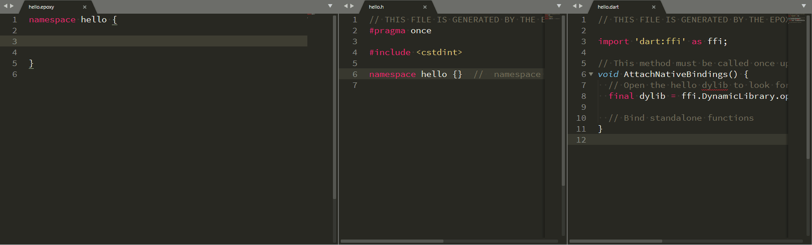

# Epoxy

[](https://github.com/chinmaygarde/epoxy/actions?query=workflow%3ALinux)
[](https://github.com/chinmaygarde/epoxy/actions?query=workflow%3AMac)
[](https://github.com/chinmaygarde/epoxy/actions?query=workflow%3AWindows)

Epoxy is an IDL and Code Generator for [Dart FFI Bindings](https://dart.dev/guides/libraries/c-interop).



# Getting Started

Epoxy is a very young project and there are currently no packaged releases. You will have to build the build the generator yourself following the [build instructions](#build-instructions). The [example/](example/) directory contains a fully setup CMake project that intergrates the code generator into the build system. The steps to integrate Epoxy into any other build system should be similar.

**Tip:** The [editor](editor/) directory contains a Textmate language definition for `.epoxy` files that should provide rudimentary syntax highlighting in most editors.

# CLI Reference

```
Epoxy FFI Bindings Code Generator
=================================

Usage:
------

    epoxy  --output <output file path>
           --idl    <Epoxy IDL file path>
           [--template-file <Template File Path>]
           [--template-data-dump]
           [--help]
           [--version]

Options:
--------

  --output            The path to the file containing the Code generated for the
                      given options. Optional if if --template-data-dump is
                      specified.

  --idl               The path the Epoxy IDL file.

  --template-file     The path to a custom code generation template. To
                      introspect the data used to render the template, use the
                      --template-data-dump option. The Inja template rendering
                      system is used to render the template data.

  --template-data-dump
                      Instead of rendering the code generation template, dump
                      the template data. This is useful when writing or
                      customizing a custom code generation template.

  --help              Dump these help instructions.

  --version           Get the Epoxy version.
```

# IDL Manual

The Epoxy interface definition can be contained in any file but is typically present in a file with the `.epoxy` suffix.

## Namespaces

Each Epoxy interface definition file must contain one or more namespaces. Namespaces are used to organize the structs and function within the interface definition file.

```
namespace hello {

} // namespace foo
```

## Primitives

The following primitives may be specified directly in an Epoxy definition file.

* `int8_t`: A signed 8-bit integer.
* `int16_t`: A signed 16-bit integer.
* `int32_t`: A signed 32-bit integer.
* `int64_t`: A signed 64-bit integer.
* `uint8_t`: An unsigned 8-bit integer.
* `uint16_t`: An unsigned 16-bit integer.
* `uint32_t`: An unsigned 32-bit integer.
* `uint64_t`: An unsigned 64-bit integer.
* `double`: A 64-bit double.
* `float`: A 32-bit float.

* `void`: The void type may be used to specify a pointer to an opaque type.

## Pointers

Pointers to primitive values or structs may be specified by prepending them with `*`.

```
function GiveIntPointer() -> int8_t*
function CreateHello() -> Hello*
function DestroyHello(Hello*) -> void
```

## Enums

Specify Enums just like you would in C/C++. Across a namespace, the enum or struct names may not be repeated.

```
enum MyEnum {
  Tinker,
  Tailor,
  Soldier,
}
```

Enums will be sugared and desugared automatically.

## Structs

Within a namespace, there may be one or more `struct` definitions. Across a namespace, the enum or struct names may not be repeated.

```
struct Hello {
  int8_t some_int;
  double some_double;
  int64_t *pointer_to_some_64_bit_int;
}
```

## Functions

Zero or more functions may appear anywhere in a `namespace` definition. Across a namespace, function names may not be repeated.

```
function AddTwoNumbers(int64_t a, int64_t b) -> int64_t
// void returns are implicit.
function ReturnVoid()
```


# Build Requirements

This project can be compiled on Windows, Linux, or, Mac. On the host, the following dependencies are required. Take a look at the [CI scripts](.github/workflows/) to see how the project is built on each platform in case you get stuck.

* A C++ 17 Compiler: This project builds fine with recent version of GCC, Clang and MSVC.
* CMake 3.0 or higher.
* [Flex 2.6.3 or higher](https://github.com/westes/flex).
* [Bison 3.3.2 or higher](https://www.gnu.org/software/bison/).

**Note:** macOS ships with very old versions of Flex and Bison. These are not suitable for Epoxy. If you are not building these from source, Homebrew contains sufficiently new versions of these dependencies.

# Build Instructions

This is an extremely straightforward CMake project. The instructions to build all targets including unit-tests are:

* Make sure the build host satisfies all [build requirements](#build-requirements).
* Update Git submodule to make sure all dependencies are pulled in.
  * `git submodule update --init --recursive`
* Create build directory and move into it.
  * `mkdir build`
  * `cd build`
* Invoke CMake to generate resources for the target build system. I like to use Ninja but Make, Xcode, Visual Studio, etc. work fine as well.
  * `cmake ../ -G Ninja` (Make is the default)
* Build the default targets.
  * `cmake --build .`
* Run the unit-test suite.
  * `ctest -VV`

You should now have the Epoxy command line code generator. Take a look at the [example/](example/) directory for a project that intergrates invoking Epoxy for code generation as an interediate step in a CMake target.
